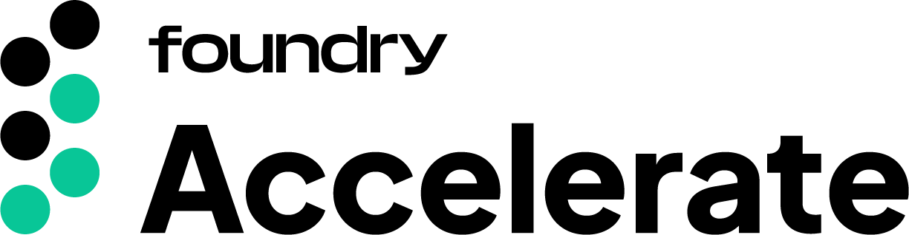

# **Bittensor SN28 - S&P 500 Oracle**

 

| This repository is the official codebase for Bittensor Subnet 28 (SN28) v1.0.0+, which was released on February 20th 2024. | **Testnet UID:**  93   **Mainnet UID:**  28 |
| - | - |

 

|     |     |
| :-: | :-: |
| **Status** |          |
| **Activity** |          |
| **Compatibility** |       |
| **Social** |        |

## Introduction

Foundry Digital is launching the Foundry S&P 500 Oracle. This subnet incentivizes accurate short term price forecasts of the S&P 500 during market trading hours.

Miners use Neural Network model architectures to perform short term price predictions on the S&P 500.

Validators store price forecasts for the S&P 500 and compare these predictions against the true price of the S&P 500 as the predictions mature.

## Usage

| Miners | Validators |
| :----: | :--------: |
| [TestNet Docs]() | [TestNet Docs]() |
| [MainNet Docs]() | [MainNet Docs]() |

## Incentive Mechanism
Please read the [incentive mechanism white paper]() to understand exactly how miners are scored and ranked.

For transparency, there are two key metrics detailed in the white paper that will be calculated to score each miner:
1. **Directional Accuracy** - was the prediction in the same direction of the true price?
2. **Mean Absolute Error** - how far was the prediction from the true price?

## Design Decisions
Integration into financial markets will expose Bittensor to the largest system in the world; the global economy. The S&P 500 serves as a perfect starting place for financial predictions given its utility and name recognition. Financial market predictions were chosen for three main reasons:

#### Utility
Financial markets provide a massive userbase of professional traders, wealth managers, and individuals alike.

#### Objective Rewards Mechanism
By tying the rewards mechanism to an external source of truth, the defensibility of the subnet regarding gamification is quite strong.

#### Adversarial Environment
The adversarial environment, especially given the rewards mechanism, will allow for significant diversity of models. Miners will be driven to acquire different datasets, implement different training methods, and utilize different Neural Network architectures in order to develop the most performant models.
